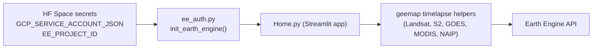

# Satellite Timelapse

A private, single-page Streamlit app for generating satellite timelapse
animations (Landsat, Sentinel-2, GOES, MODIS, NAIP, or any Earth Engine
`ImageCollection`) over any region on Earth. Designed for agricultural and
environmental research and deployed on a private Hugging Face Space.

Forked and slimmed down from
[opengeos/streamlit-geospatial](https://github.com/opengeos/streamlit-geospatial).

## Architecture



Authentication uses a Google Cloud **service account** registered for Earth
Engine, so the app does not require the biweekly browser re-authentication
that the upstream demo did.

## Prerequisites

- A Google account (will be associated with your Google Cloud project).
- A Hugging Face account (the Space can be free CPU and stay private).
- Basic familiarity with the terminal (Python venv, environment variables).

## One-time setup (≈20 minutes)

You need to set this up once per owner. When ownership changes, the new
owner repeats these steps with their own Google + Hugging Face accounts.

### 1. Create a Google Cloud project

1. Sign in to the [Google Cloud Console](https://console.cloud.google.com/).
2. In the top bar, open the project picker and click **New Project**.
3. Name it something memorable (for example, `timelapse-research`) and create it.
4. Copy the **Project ID** (lowercase string under the project name). You will
   use this as `EE_PROJECT_ID` later. The display name and project number do
   not work; you need the ID.

### 2. Register the project for Earth Engine (noncommercial / research)

1. Go to <https://console.cloud.google.com/earth-engine> with your new project
   selected.
2. Follow the prompts to register the project. Choose **Noncommercial /
   academic research** if applicable; this is free.
3. Wait until the registration completes successfully before proceeding.

### 3. Enable the Earth Engine API

Open the [Earth Engine API page](https://console.cloud.google.com/apis/library/earthengine.googleapis.com)
with the same project selected, then click **Enable**.

### 4. Create a service account

1. Open **IAM & Admin → Service Accounts** in the Cloud Console.
2. Click **Create service account**.
3. Name it (for example, `timelapse-hf`) and create it. Skip the optional
   "grant access" wizard for now (we will set IAM roles in the next step).
4. Copy the service account email; it looks like
   `timelapse-hf@<project-id>.iam.gserviceaccount.com`.

### 5. Grant IAM roles

In **IAM & Admin → IAM**, click **Grant access** and add the service account
email as a principal with both of these roles:

| Role                          | ID                                          |
| ----------------------------- | ------------------------------------------- |
| Service Usage Consumer        | `roles/serviceusage.serviceUsageConsumer`   |
| Earth Engine Resource Writer  | `roles/earthengine.writer`                  |

Service Usage Consumer is required so `ee.Initialize(project=...)` can use the
Cloud project. Earth Engine Resource Writer is the standard role for running
interactive Earth Engine computations like timelapses.

### 6. Download a JSON key

1. Open the service account → **Keys → Add key → Create new key → JSON**.
2. Save the downloaded JSON file somewhere safe. Treat it like a password.
3. Do **not** commit it to git. The repo's `.gitignore` already covers `.env`
   and `private/`, but be careful when pasting elsewhere.

### 7. Create a private Hugging Face Space

1. Go to <https://huggingface.co/new-space>.
2. Choose **SDK: Streamlit**, **Visibility: Private**, **Hardware: CPU basic**.
3. Either link this GitHub repository, or push the repo contents to the Space
   git remote.

### 8. Add the secrets to the Space

In the Space's **Settings → Variables and secrets**, add:

| Name                        | Type   | Value                                                                  |
| --------------------------- | ------ | ---------------------------------------------------------------------- |
| `GCP_SERVICE_ACCOUNT_JSON`  | Secret | Paste the **entire** contents of the service account JSON file         |
| `EE_PROJECT_ID`             | Secret | Your GCP project ID (the lowercase string from step 1)                 |

Then **Restart** the Space. After the build completes, the Timelapse app
should load and render the map.

## Local development

```bash
git clone <this-repo>
cd streamlit-geospatial

python -m venv .venv
source .venv/bin/activate
pip install -r requirements.txt

cp .env.example .env
# Edit .env and paste your service account JSON + project id.
# Make sure GCP_SERVICE_ACCOUNT_JSON is on a single line of valid JSON.

# Streamlit reads environment variables from your shell; export them or use
# a tool like `direnv` / `dotenv` to load the .env file before running.
streamlit run Home.py
```

The system dependencies in [`packages.txt`](packages.txt) (ffmpeg, gifsicle,
GDAL, etc.) are installed automatically on Hugging Face Spaces. For local
macOS development you can install equivalents via Homebrew (`brew install
ffmpeg gifsicle gdal`).

## Cost expectations

Under the noncommercial Earth Engine tier this app is free:

- **Earth Engine**: free for noncommercial / academic use within fair-use
  quotas.
- **Google Cloud**: creating projects, service accounts, and JSON keys is
  free. You may be asked to attach a billing account to enable APIs; you will
  not be charged unless you turn on other billable products. To be safe, set a
  [budget alert](https://cloud.google.com/billing/docs/how-to/budgets) at
  `$0.01` so you get an email if any service ever incurs cost.
- **Hugging Face**: a private Streamlit Space on CPU basic is free.

If you hit Earth Engine quota errors with very large regions or long date
ranges, shrink the region of interest or shorten the date range. The app's
default is generous but Earth Engine will reject extreme requests.

## Troubleshooting

| Symptom | Likely cause | Fix |
| --- | --- | --- |
| `GCP_SERVICE_ACCOUNT_JSON not set` | Secret missing or misnamed on the Space | Add it under Settings → Variables and secrets, then restart |
| `... is not valid JSON` | Pasted only part of the key file, or smart-quotes | Re-copy the file contents in full and paste again |
| `Permission denied on resource project ...` | Missing IAM role | Add `roles/serviceusage.serviceUsageConsumer` and `roles/earthengine.writer` to the service account |
| `Earth Engine client library has not been initialized` | App tried to call EE before init | Reload the page; if it persists, check the Space build logs |
| Timelapse computation errors mid-run | ROI too large or date range too long | Shrink the bounding box or pick a shorter time window |
| App was working, suddenly fails to authenticate | SA key revoked or project unregistered | Recreate the key (step 6) and / or re-register the project for Earth Engine |

For deeper context (architecture decisions, geemap internals, IAM trade-offs)
see [`.agent/agent.md`](.agent/agent.md).

## Credential rotation and ownership handoff

Because all credentials live in **Hugging Face Space secrets**, transferring
ownership is a credential swap with no code changes:

1. New owner completes steps 1–6 (their own GCP project + service account).
2. New owner is added as a collaborator on the Space (or the Space is
   transferred to them).
3. New owner replaces the values of `GCP_SERVICE_ACCOUNT_JSON` and
   `EE_PROJECT_ID` in the Space settings, then restarts the Space.
4. New owner confirms a small timelapse renders successfully.
5. Previous owner deletes the old service account key from
   **IAM & Admin → Service Accounts → Keys** to revoke access.

That sequence avoids any window where two owners hold valid credentials.

## Repository layout

```
.
├── .agent/agent.md          # internal architecture / decisions doc
├── .env.example             # local development environment template
├── .github/                 # FUNDING.yml (and optional smoke-test workflow)
├── ee_auth.py               # service-account Earth Engine auth helper
├── Home.py                  # Streamlit app (the only page)
├── packages.txt             # APT packages installed on Hugging Face Spaces
├── requirements.txt         # Python dependencies
└── README.md                # this file (also serves as HF Space front matter)
```

## License

MIT — see [`LICENSE`](LICENSE).
