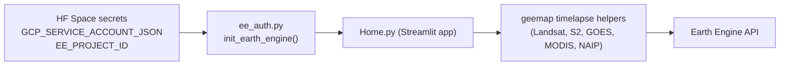

# Satellite Timelapse

A private, single-page Streamlit app for generating satellite timelapse
animations (Landsat, Sentinel-2, GOES, MODIS, NAIP, or any Earth Engine
`ImageCollection`) over any region on Earth. Designed for agricultural and
environmental research and deployed on a private Hugging Face Space.

Forked and slimmed down from
[opengeos/streamlit-geospatial](https://github.com/opengeos/streamlit-geospatial).

## Architecture



Authentication uses a Google Cloud **service account** registered for Earth
Engine, so the app does not require the biweekly browser re-authentication
that the upstream demo did.

## Prerequisites

- A Google account (will be associated with your Google Cloud project).
- A Hugging Face account (the Space can be free CPU and stay private).
- Basic familiarity with the terminal and [Docker](https://docs.docker.com/get-docker/) for local runs (optional native Python is documented below).

## One-time setup (≈20 minutes)

You need to set this up once per owner. When ownership changes, the new
owner repeats these steps with their own Google + Hugging Face accounts.

### 1. Create a Google Cloud project

1. Sign in to the [Google Cloud Console](https://console.cloud.google.com/).
2. In the top bar, open the project picker and click **New Project**.
3. Name it something memorable (for example, `timelapse-research`) and create it.
4. Copy the **Project ID** (lowercase string under the project name). You will
   use this as `EE_PROJECT_ID` later. The display name and project number do
   not work; you need the ID.

### 2. Register the project for Earth Engine (noncommercial / research)

1. Go to <https://console.cloud.google.com/earth-engine> with your new project
   selected.
2. Follow the prompts to register the project. Choose **Noncommercial /
   academic research** if applicable; this is free.
3. Wait until the registration completes successfully before proceeding.

### 3. Enable the Earth Engine API

Open the [Earth Engine API page](https://console.cloud.google.com/apis/library/earthengine.googleapis.com)
with the same project selected, then click **Enable**.

### 4. Create a service account

1. Open **IAM & Admin → Service Accounts** in the Cloud Console.
2. Click **Create service account**.
3. Name it (for example, `timelapse-hf`) and create it. Skip the optional
   "grant access" wizard for now (we will set IAM roles in the next step).
4. Copy the service account email; it looks like
   `timelapse-hf@<project-id>.iam.gserviceaccount.com`.

### 5. Grant IAM roles

In **IAM & Admin → IAM**, click **Grant access** and add the service account
email as a principal with both of these roles:

| Role                          | ID                                          |
| ----------------------------- | ------------------------------------------- |
| Service Usage Consumer        | `roles/serviceusage.serviceUsageConsumer`   |
| Earth Engine Resource Writer  | `roles/earthengine.writer`                  |

Service Usage Consumer is required so `ee.Initialize(project=...)` can use the
Cloud project. Earth Engine Resource Writer is the standard role for running
interactive Earth Engine computations like timelapses.

### 6. Download a JSON key

1. Open the service account → **Keys → Add key → Create new key → JSON**.
2. Save the downloaded JSON file somewhere safe. Treat it like a password.
3. Do **not** commit it to git. The repo's `.gitignore` already covers `.env`
   and `private/`, but be careful when pasting elsewhere.

**Deploy path (Hugging Face + GitHub Actions)** — do these in order after steps 1–6:

1. **Create** a private Docker Space on Hugging Face (step **7**).
2. **Add Earth Engine secrets** on the Space: `GCP_SERVICE_ACCOUNT_JSON` and `EE_PROJECT_ID` (step **8**).
3. **Add deploy credentials** on GitHub: repository secret `HF_TOKEN` and variable `HF_SPACE_REPO` (step **9**).
4. **Push to `main`** on GitHub. [`.github/workflows/sync_to_hub.yml`](.github/workflows/sync_to_hub.yml) pushes this repo to the Space; Hugging Face then **rebuilds the Docker image** and runs the app.

You do not need to `git push` to Hugging Face manually if you use this workflow.

### 7. Create a private Hugging Face Space

Hugging Face **removed the standalone Streamlit SDK** from the Space creation
wizard ([changelog entry](https://huggingface.co/docs/hub/spaces-changelog), 2025-04-30). **New Streamlit apps use the Docker SDK.**

1. Go to <https://huggingface.co/new-space>.
2. Choose **SDK: Docker**, **Visibility: Private**, **Hardware: CPU basic**.
3. Pick the **Streamlit** Docker template, or an **empty** Docker Space (the first sync in step **9** will replace template files with this repo).

Hugging Face creates a **git repository on the Hub** for the Space. There is no “link my GitHub repo” button for Docker Spaces — code is shipped with **GitHub Actions** in step **9**.

This repository ships a root [`Dockerfile`](Dockerfile) that installs apt packages
(mirroring [`packages.txt`](packages.txt)), runs `pip install -r requirements.txt`, and
starts Streamlit on port **7860** (required for Docker Spaces). Streamlit is started with
**XSRF protection disabled** so `st.file_uploader` (GeoJSON uploads) works when the Space
is embedded on `huggingface.co` (cookie / iframe limitations; see
[Hugging Face docs on Spaces cookies](https://huggingface.co/docs/hub/spaces-cookie-limitations)).
The YAML block at the top of this [`README.md`](README.md) sets `sdk: docker` and
`app_port: 7860` so the Hub routes traffic correctly.

### 8. Add Earth Engine secrets on the Space

In the Space's **Settings → Variables and secrets**, add:

| Name                        | Type   | Value                                                                  |
| --------------------------- | ------ | ---------------------------------------------------------------------- |
| `GCP_SERVICE_ACCOUNT_JSON`  | Secret | Paste the **entire** contents of the service account JSON file         |
| `EE_PROJECT_ID`             | Secret | Your GCP project ID (the lowercase string from step 1)                 |

If the Space was already running, use **Restart** or **Factory reboot** in the Space settings so new secrets are picked up cleanly.

Save, then continue to step **9** before expecting the app to work in the browser (the Space needs both the image from GitHub **and** these runtime secrets).

### 9. Connect GitHub and push to main

Keep **GitHub as the source of truth**. This repo includes
[`.github/workflows/sync_to_hub.yml`](.github/workflows/sync_to_hub.yml), which mirrors
the [official Hub pattern](https://huggingface.co/docs/hub/spaces-github-actions).

1. **Create a Hugging Face access token** with **write** access (classic *Write*
   token, or a fine-grained token that can write to your Space repository).  
   [https://huggingface.co/settings/tokens](https://huggingface.co/settings/tokens)

2. **On GitHub** (this repository): **Settings → Secrets and variables → Actions**

   - **Secrets → New repository secret**  
     - Name: `HF_TOKEN`  
     - Value: your Hugging Face token

   - **Variables → New repository variable**  
     - Name: `HF_SPACE_REPO`  
     - Value: `your_hf_username/your_space_name`  
       (exactly as in the Space URL: `https://huggingface.co/spaces/your_hf_username/your_space_name`)

3. **Push to `main`** (merge a PR, or **Actions → Sync to Hugging Face Space → Run workflow**).
   The workflow **force-pushes** `main` to the Space’s Hub git remote. Hugging Face picks up the new commit and **rebuilds / redeploys** the Space.

**Notes**

- The first successful sync overwrites whatever files the Space template created.
- If your default branch is not `main`, either rename it or edit the workflow branch list and the `git push … HEAD:main` line in `sync_to_hub.yml`.
- `HF_TOKEN` and `HF_SPACE_REPO` are **only for GitHub Actions** (and optional local tooling). They are **not** Space runtime secrets and are **not** read by `Home.py`.

After the Space build finishes, open the Space URL — the map should load if step **8** is complete.

## Local development (Docker)

Use the same [`Dockerfile`](Dockerfile) as Hugging Face so a successful local
build is a strong signal the Space build will work.

**Prerequisites:** Docker (Docker Desktop on macOS/Windows, or Docker Engine on
Linux). Compose file v2 is bundled as `docker compose`.

```bash
git clone <this-repo>
cd streamlit-geospatial

cp .env.example .env
# Edit .env: set GCP_SERVICE_ACCOUNT_JSON and EE_PROJECT_ID for Earth Engine.
# Keep GCP_SERVICE_ACCOUNT_JSON as one line of valid JSON.
# Optional: HF_TOKEN / HF_SPACE_REPO — for local Hub tooling only; the app does
# not read them for timelapses.

docker compose up --build
```

Open **http://localhost:7860** in your browser.

- **Rebuild from scratch** (after changing `requirements.txt` or APT deps):  
  `docker compose build --no-cache && docker compose up`
- **Edit code without rebuilding the image:** uncomment the `volumes` block in
  [`docker-compose.yml`](docker-compose.yml) to bind-mount the repo into
  `/home/user/app`. Python packages still come from the image.

### Without Compose

```bash
docker build -t streamlit-geospatial:local .
docker run --rm -p 7860:7860 --env-file .env streamlit-geospatial:local
```

### Optional: native Python (no Docker)

If you prefer a venv on the host, install system packages yourself (same roles
as [`packages.txt`](packages.txt); on macOS for example
`brew install ffmpeg gifsicle gdal`), then:

```bash
python -m venv .venv
source .venv/bin/activate   # Windows: .venv\Scripts\activate
pip install -r requirements.txt
# Load .env into your shell (export, direnv, etc.), then:
streamlit run Home.py
```

## Cost expectations

Under the noncommercial Earth Engine tier this app is free:

- **Earth Engine**: free for noncommercial / academic use within fair-use
  quotas.
- **Google Cloud**: creating projects, service accounts, and JSON keys is
  free. You may be asked to attach a billing account to enable APIs; you will
  not be charged unless you turn on other billable products. To be safe, set a
  [budget alert](https://cloud.google.com/billing/docs/how-to/budgets) at
  `$0.01` so you get an email if any service ever incurs cost.
- **Hugging Face**: a private Streamlit Space on CPU basic is free.

If you hit Earth Engine quota errors with very large regions or long date
ranges, shrink the region of interest or shorten the date range. The app's
default is generous but Earth Engine will reject extreme requests.

## Troubleshooting

| Symptom | Likely cause | Fix |
| --- | --- | --- |
| `GCP_SERVICE_ACCOUNT_JSON not set` | Secret missing or misnamed on the Space | Add it under Settings → Variables and secrets, then restart |
| `... is not valid JSON` | Pasted only part of the key file, or smart-quotes | Re-copy the file contents in full and paste again |
| `Permission denied on resource project ...` | Missing IAM role | Add `roles/serviceusage.serviceUsageConsumer` and `roles/earthengine.writer` to the service account |
| `Earth Engine client library has not been initialized` | App tried to call EE before init | Reload the page; if it persists, check the Space build logs |
| Timelapse computation errors mid-run | ROI too large or date range too long | Shrink the bounding box or pick a shorter time window |
| App was working, suddenly fails to authenticate | SA key revoked or project unregistered | Recreate the key (step 6) and / or re-register the project for Earth Engine |
| GitHub Action “Sync to Hugging Face Space” fails | Missing `HF_TOKEN` or `HF_SPACE_REPO`, or wrong Space path | Add the secret and variable under repo **Settings → Actions**; `HF_SPACE_REPO` must be `username/space-name` |
| `git push` rejected (401) | Token expired or lacks write scope | Regenerate token at HF settings; ensure **write** to that Space |
| `AxiosError` **403** on file upload (GeoJSON) on the Space only | Streamlit XSRF + HF iframe / proxy cookie behavior for Docker Spaces | Already fixed in this repo’s `Dockerfile` (`--server.enableXsrfProtection false`); rebuild / redeploy the Space |

For deeper context (architecture decisions, geemap internals, IAM trade-offs)
see [`.agent/agent.md`](.agent/agent.md).

## Credential rotation and ownership handoff

Because all **runtime** credentials live in **Hugging Face Space secrets**, and
**deploy** credentials live in **GitHub Actions**, transferring ownership is
mostly updating those values:

1. New owner completes steps **1–6** (their own GCP project + service account).
2. New owner gets access to the **Space** and this **GitHub** repository (collaborator or transfer).
3. New owner updates **Space** secrets `GCP_SERVICE_ACCOUNT_JSON` and `EE_PROJECT_ID`, and **GitHub** secret `HF_TOKEN` plus variable `HF_SPACE_REPO` if the Space URL or HF account changed; then **push to `main`** (or run the sync workflow) so the Space redeploys.
4. New owner confirms a small timelapse renders successfully.
5. Previous owner deletes the old service account key from
   **IAM & Admin → Service Accounts → Keys** to revoke access.

That sequence avoids any window where two owners hold valid credentials.

## Repository layout

```
.
├── .agent/agent.md          # internal architecture / decisions doc
├── docker-compose.yml       # local `docker compose up` (same image as HF)
├── .dockerignore            # Docker build context exclusions
├── .env.example             # local development environment template
├── .github/workflows/       # sync_to_hub.yml, ee-smoke-test.yml
├── Dockerfile               # HF Spaces Docker SDK image (Streamlit on port 7860)
├── ee_auth.py               # service-account Earth Engine auth helper
├── Home.py                  # Streamlit app (the only page)
├── packages.txt             # APT packages (mirrored in Dockerfile for HF)
├── requirements.txt         # Python dependencies
└── README.md                # this file (HF Space front matter: sdk docker)
```

## License

MIT — see [`LICENSE`](LICENSE).
